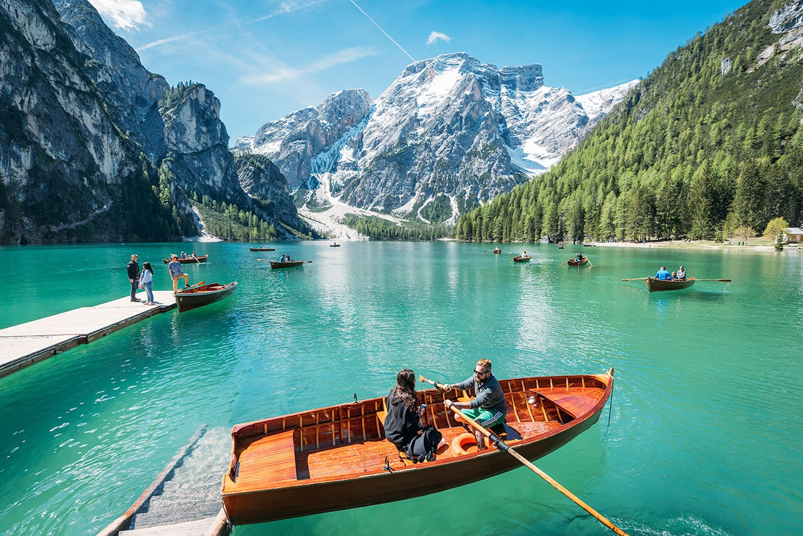

import Counter from '../../components/counter'

# The largest natural lake in the Dolomites

Arguably one of Italy’s most beautiful lakes, ** Lago di Braies** is a bright blue mountain lake in the heart of the Dolomites. Here are some tips for visiting & having a good time.

# What you can expect

-  From Venice we travel north for 2 and a half hours to reach the most famous lake in the Dolomites, just a few kilometers from the border with Austria, the incredible Braies Lake that attracts more than 5000 visitors a day;

- Along the road we will have the chance to have coffee in the famous Cortina d'Ampezzo, site of the Winter Olympic Games in 1956;

- Then we will visit the Heart of the Dolomites, the Misurina Lake with the famous Three Peaks of Lavaredo: these are the best known mountains in the Alps as well as the most photographed and the most represented on postcards and calendars;

- To the west of Cortina we will pass on one of the most scenic passes of the Dolomites, the Giau Pass (2,236 m above sea level);

- On the way back we will use another panoramic road of the Dolomites that will lead us, through the Staulanza Pass, back to Venice.

# Boat Rentals On The Lake
Probably the most popular activity to do on the lake is rent one of the cool wooden row-boats and cruise around the photogenic emerald-colored waters.

<Counter />
